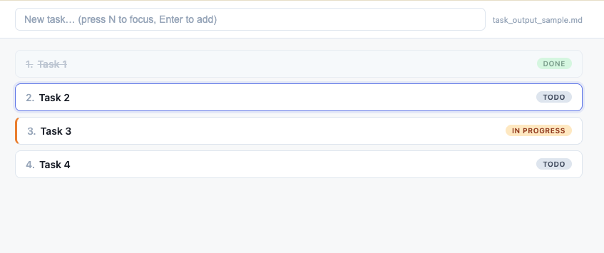
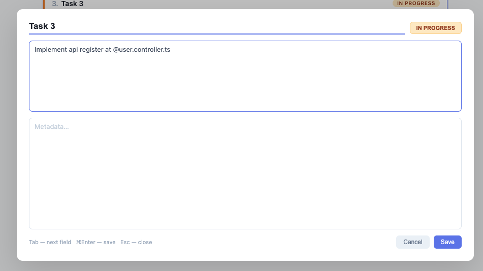

# task.html

A single-file, keyboard-driven task tracker that stores tasks in a
plain-text Markdown file (`task.md`) you can read with any editor — or
hand to an LLM as input.

No server. No build step. No `node_modules`. One HTML file, one data
file, in any modern Chromium browser.



## Highlights

- **100% keyboard navigation** — every action (add, move, view, toggle
  status, delete) has a single-key shortcut. Mouse optional.
- **100% local** — your tasks live in a `task.md` on your own disk.
  No account, no server, no cloud sync, no telemetry. The browser
  talks directly to the file via the File System Access API.
- **LLM-friendly** — `task.md` is YAML stanzas with a self-describing
  header that tells any LLM how to read the format and which tasks to
  act on. Built for the "capture in the UI, let Claude do the work"
  loop.

## Where the idea came from

I kept catching myself sending Claude a stream of small, related
prompts: "fix X", "also rename Y", "and update Z". Each one was its
own round-trip — me typing, Claude re-loading context, both of us
paying the switching cost.

`task.html` is the answer to that: dump every small task into the
list in seconds (it's just `N` + type + `Enter`), mark the ones you
want done, and then hand the whole batch to Claude in a single
prompt — *"read `task.md` and work through everything marked
`inprogress`"*. One conversation, many tasks done.

## Why

Most task apps either lock your data into a proprietary store or
need a server to sync. `task.html` is a ~30 KB local file that talks
directly to a `task.md` on your disk through the
[File System Access API](https://developer.mozilla.org/docs/Web/API/File_System_Access_API),
so:

- Your tasks live in a file you fully own.
- You can `cat`, `grep`, `git diff`, and version-control them.
- An LLM can read `task.md` directly — the file's header explicitly
  documents the format and which tasks the LLM should act on.

## Quick start

1. Download `task.html` (just the single file).
2. Open it in **Chrome, Edge, Arc, Brave, or any Chromium-based
   browser**. Safari and Firefox are **not** supported (they don't yet
   expose the File System Access API).
3. Click **Open task.md** and either pick an existing file or create a
   new one. The file handle is remembered in IndexedDB so the same
   file reopens on subsequent visits (you'll be asked once per browser
   session to re-grant permission).
4. Start adding tasks — press `N`, type, hit `Enter`.

## Keyboard shortcuts

### List view

| Key                | Action                                   |
| ------------------ | ---------------------------------------- |
| `N`                | Focus the quick-add input                |
| `J` / `K` / arrows | Move focus up / down                     |
| `Enter`            | Open the focused task                    |
| `Space`            | Cycle status (todo → in-progress → done) |
| `Backspace`        | Remove focused task (asks to confirm)    |
| `Esc`              | Cancel / blur the input                  |

### Inside the quick-add input

| Key     | Action                              |
| ------- | ----------------------------------- |
| `Enter` | Add the typed task to the bottom    |
| `Esc`   | Clear and unfocus                   |

### Inside the edit modal



| Key             | Action                                       |
| --------------- | -------------------------------------------- |
| `Tab`           | Move between Name / Description / Metadata / Status |
| `Space`         | Cycle status (when focus is on the button, not a text field) |
| `⌘Enter` / `Enter` outside a textarea | Save and close         |
| `Esc`           | Close without saving                         |

Edits in the modal autosave to disk after ~600 ms of inactivity.

## File format (`task.md`)

Each task is a YAML stanza, separated by `---`. The format is chosen
to be compact and unambiguous for LLMs:

```yaml
index: 1
name: Buy milk
status: inprogress
description: |
  Pick up 2L whole milk.
  ```sh
  echo "code fences are fine inside descriptions"
  ```
metadata: |
  - due: today
  - priority: low

---

index: 2
name: Refactor auth
status: todo
description:
metadata:
```

Field summary:

- `index` — 1-based position. Renumbered on every save. Use it when
  telling an LLM which task to work on ("do task 3").
- `name` — single line. Quoted with `'…'` only if it contains
  YAML-significant characters.
- `status` — one of `todo`, `inprogress`, `done`.
- `description` — free-form. Empty, single-line, or a `|` block scalar
  for multi-line content (code fences, lists, anything).
- `metadata` — same shape as description; intended for due dates,
  tags, links, or any per-task notes.

The file also begins with an HTML comment block documenting these
rules for any LLM that reads it. The comment is invisible to Markdown
renderers but visible to text-reading tools.

## LLM integration

A typical workflow:

1. Capture tasks during the day with `task.html` (keyboard-only,
   fast).
2. Mark the tasks you want help with as `inprogress`.
3. Open Claude (or your LLM of choice) in the same directory and tell
   it something like: *"Read `task.md` and work through everything
   marked `inprogress`. Mark each one `done` when you finish it."*
4. The header in `task.md` instructs the LLM to (a) act only on
   `status: inprogress` tasks and (b) flip each task's `status:` to
   `done` once it's complete — so when you come back, the list
   already reflects what's left.

You can also let an LLM **write** to `task.md` — the format is
designed so a competent model can append or edit stanzas correctly
without breaking the parser. `task.html` will pick up the changes on
next reload.

## Constraints and known limitations

- Chromium-only. Firefox and Safari lack the File System Access API.
- New tasks always go to the bottom; no reorder / drag-and-drop yet.
- The horizontal padding on the list/input is currently a fixed
  `400 px`, so the layout assumes a viewport wider than about
  1000 px. Mobile is not a target right now.
- One file at a time. Multi-project / multi-list support would need
  rework.
- No undo. `Backspace` asks to confirm before removing; status cycling
  is reversible.

## Contributing

This is a single self-contained file by design — please keep PRs that
way. If a feature would require pulling in a build tool, a
`node_modules`, or splitting the source into multiple files, open an
issue first to discuss.

## License

MIT (replace this with your preferred license before publishing).
